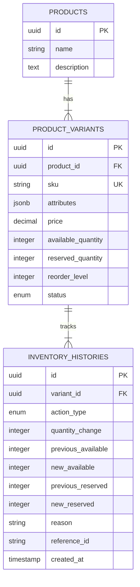

# Inventory Management System

Production-ready backend API for multi-variant product inventory management with pessimistic row locking for concurrency protection, transactional audit trails, and Joi payload validation.

---

## Tech Stack
- **Runtime:** Node.js (v18+)
- **Framework:** Express.js
- **Database:** PostgreSQL (v14+)
- **ORM:** Sequelize
- **Validation:** Joi
- **Testing:** Jest + Supertest

---

## Database Architecture



### Business Rules & Constraints
- **Inventory Pool:** `Total Stock = available_quantity + reserved_quantity`.
- **Reserve:** `available_quantity -= qty`, `reserved_quantity += qty`. Fails if `qty > available_quantity`.
- **Release:** `available_quantity += qty`, `reserved_quantity -= qty`. Fails if `qty > reserved_quantity`.
- **Integrity Constraints:** Database-level `CHECK (available_quantity >= 0)` and `CHECK (reserved_quantity >= 0)`.
- **Audit:** Every stock modification, reservation, or release writes an immutable `inventory_histories` entry inside the same database transaction.

---

## Quick Start

### 1. Install Dependencies
```bash
npm install
```

### 2. Configure Environment
Copy `.env.example` to `.env` and set PostgreSQL credentials:
```env
PORT=3000
DB_NAME=inventory_db
DB_USER=postgres
DB_PASSWORD=your_password
DB_HOST=localhost
DB_PORT=5432
DB_LOGGING=false
```

### 3. Seed Database
Seeds default T-Shirt variants (Small/Red, Medium/Red, Large/Red, Small/Blue):
```bash
npm run seed
```

### 4. Run Application
```bash
# Development
npm run dev

# Production
npm start
```

### 5. Run Tests & Linter
```bash
# Run unit, integration, and concurrency race tests
npm test

# Linting
npm run lint
```

---

## API Endpoints

### 1. View Inventory
`GET /api/inventory`

**Query Parameters:**
| Param | Type | Description |
|---|---|---|
| `search` | String | Case-insensitive match on SKU or Product Name |
| `status` | String | `ACTIVE`, `INACTIVE`, `OUT_OF_STOCK` |
| `lowStock` | Boolean | Filter items where `available_quantity <= reorder_level` |
| `page` | Integer | Default: 1 |
| `limit` | Integer | Default: 10, Max: 100 |
| `sortBy` | String | `sku`, `price`, `availableQuantity`, `reservedQuantity`, `createdAt` |
| `sortOrder` | String | `ASC` or `DESC` (Default: `DESC`) |

**Sample Response (`200 OK`):**
```json
{
  "success": true,
  "statusCode": 200,
  "message": "Inventory retrieved successfully",
  "data": [
    {
      "id": "18c8cd16-1127-4751-9b93-8a24e7368ed2",
      "sku": "TSHIRT-RED-M",
      "attributes": { "size": "Medium", "color": "Red" },
      "price": "21.99",
      "availableQuantity": 100,
      "reservedQuantity": 10,
      "reorderLevel": 20,
      "status": "ACTIVE",
      "product": {
        "id": "550e8400-e29b-41d4-a716-446655440000",
        "name": "Classic Cotton T-Shirt",
        "description": "Premium quality 100% combed cotton unisex crewneck t-shirt."
      }
    }
  ],
  "meta": {
    "totalItems": 1,
    "itemCount": 1,
    "itemsPerPage": 10,
    "totalPages": 1,
    "currentPage": 1,
    "hasNextPage": false,
    "hasPrevPage": false
  }
}
```

---

### 2. Update Stock
`PATCH /api/inventory/:variantId`

**Request Body:**
```json
{
  "availableQuantity": 120,
  "price": 22.50,
  "reorderLevel": 25,
  "status": "ACTIVE",
  "reason": "Shipment received",
  "referenceId": "PO-10023"
}
```

**Response (`200 OK`):**
```json
{
  "success": true,
  "statusCode": 200,
  "message": "Inventory stock updated successfully",
  "data": {
    "id": "18c8cd16-1127-4751-9b93-8a24e7368ed2",
    "sku": "TSHIRT-RED-M",
    "availableQuantity": 120,
    "reservedQuantity": 10,
    "price": "22.50",
    "status": "ACTIVE"
  }
}
```

---

### 3. Reserve Stock
`POST /api/inventory/:variantId/reserve`

**Request Body:**
```json
{
  "quantity": 5,
  "reason": "Customer checkout",
  "referenceId": "ORD-55412"
}
```

**Response (`200 OK`):**
```json
{
  "success": true,
  "statusCode": 200,
  "message": "Stock reserved successfully",
  "data": {
    "id": "18c8cd16-1127-4751-9b93-8a24e7368ed2",
    "sku": "TSHIRT-RED-M",
    "availableQuantity": 95,
    "reservedQuantity": 15,
    "status": "ACTIVE"
  }
}
```

**Error Response (`409 Conflict`):**
```json
{
  "success": false,
  "statusCode": 409,
  "message": "Requested reservation quantity exceeds available stock. Available: 2, Requested: 5",
  "error": {
    "availableQuantity": 2,
    "requestedQuantity": 5
  }
}
```

---

### 4. Release Reserved Stock
`POST /api/inventory/:variantId/release`

**Request Body:**
```json
{
  "quantity": 2,
  "reason": "Customer cancelled item",
  "referenceId": "ORD-55412-CANCEL"
}
```

**Response (`200 OK`):**
```json
{
  "success": true,
  "statusCode": 200,
  "message": "Reserved stock released successfully",
  "data": {
    "id": "18c8cd16-1127-4751-9b93-8a24e7368ed2",
    "sku": "TSHIRT-RED-M",
    "availableQuantity": 97,
    "reservedQuantity": 13,
    "status": "ACTIVE"
  }
}
```

---

### 5. View Stock History
`GET /api/inventory/:variantId/history`

**Query Parameters:**
- `page`: default 1
- `limit`: default 10
- `actionType`: `STOCK_UPDATE`, `RESERVE`, `RELEASE` (optional)

**Response (`200 OK`):**
```json
{
  "success": true,
  "statusCode": 200,
  "message": "Inventory history retrieved successfully",
  "data": {
    "variant": {
      "id": "18c8cd16-1127-4751-9b93-8a24e7368ed2",
      "sku": "TSHIRT-RED-M",
      "availableQuantity": 97,
      "reservedQuantity": 13,
      "status": "ACTIVE"
    },
    "histories": [
      {
        "id": "23351d3b-001d-40cf-82e1-4566778899aa",
        "actionType": "RELEASE",
        "quantityChange": 2,
        "previousAvailable": 95,
        "newAvailable": 97,
        "previousReserved": 15,
        "newReserved": 13,
        "reason": "Customer cancelled item",
        "referenceId": "ORD-55412-CANCEL",
        "createdAt": "2026-09-25T07:15:00.000Z"
      }
    ]
  },
  "meta": {
    "totalItems": 1,
    "itemCount": 1,
    "itemsPerPage": 10,
    "totalPages": 1,
    "currentPage": 1,
    "hasNextPage": false,
    "hasPrevPage": false
  }
}
```

---

## Concurrency Handling Strategy

High-traffic operations (reservation, release, stock adjustments) execute inside a managed database transaction with PostgreSQL row-level locks:
```javascript
// Row-level lock ensures serializable updates per variant without race conditions
const variant = await ProductVariant.findByPk(variantId, {
  lock: t.LOCK.UPDATE, // translates to SELECT ... FOR UPDATE
  transaction: t
});
```
- **Mutual Exclusion:** Competing requests for the same variant wait their turn on the database lock.
- **Atomicity:** Audit history creation and variant quantity mutations commit or rollback together.
- **Stress-tested:** Verified via `tests/concurrency.test.js` where 10 parallel requests compete for limited stock with zero race conditions or negative quantities.

---

## Postman Collection
Import file located at:
`postman/Inventory_Management.postman_collection.json`
Preconfigured with base URL (`http://localhost:3000`) and sample requests.
